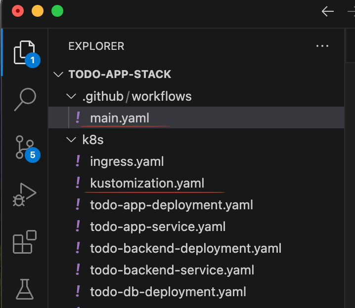

### Exercise3.03

In this exercise, I set up automatic deployment for a full-stack application consisting of:

Frontend: todo-app
Backend: todo-backend
Database: PostgreSQL

The deployment is managed using Kubernetes cluster (GKE — Google Kubernetes Engine), GitHub Actions (CI/CD pipeline), Docker (for containerizing the applications)

I started with creating a new GKE Kubernetes cluster in the region us-central1.
I Configured Google Cloud IAM roles and permissions for GitHub Actions.

I generated a key and used it to add github secrets:

Then I created a kustomization file and a main.yaml file that automates the proces of Building Docker images, Pushing images to Artifact Registry, Updating Kubernetes Deployments automatically, and added retry logic during rollout to handle potential Kubernetes delays.

 
Finally i pushed the chanes to github and we can see that the workflow is created and everything is working:

### Exercise3.04
