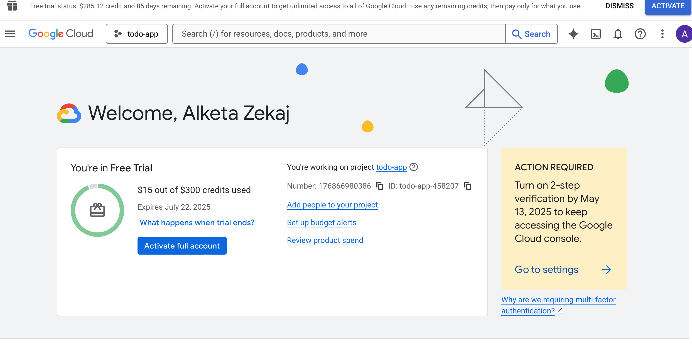

### EXERCISE2.02

The goal of this projectwas to build and deploy a simple full-stack Todo application on Kubernetes using:

A Node.js frontend (with HTML/JS + dynamic image loading)
A Node.js backend (Express REST API)
HTTP communication between frontend and backend
Persistent access via Kubernetes Ingress

We load a random image from https://picsum.photos. Add a todo via input fieldView todos dynamically via API call the backend manages todos in memory and kubernetes handles deployments, services, and routing.

I decided to build the backend  with Node.js + Expres. The backend exposes two endpoints
GET /todos – fetch all todos
POST /todos – add a new todo
And Data is stored in memory.

In the browser, we’ll see:

After I saved some inputs in my todo list:

### EXERCISE2.04

For this exercise I created a namespace as a yaml file

I updated all the yaml files inside the k8s folder 

And then i reappplied the deployments

### EXERCISE2.08

The goal of this exercise is to enhance the To-do application by introducing persistent storage for todos using a PostgreSQL database. The main objective was to move from in-memory data storage to a stateful backend that stores todos in a database across pod restarts.

I created a PostgreSQL database as a separate pod and exposed it using a ClusterIP service.
Then created a PersistentVolumeClaim to ensure database data is preserved even if the pod restarts.Secured database credentials (POSTGRES_USER, POSTGRES_PASSWORD, POSTGRES_DB) using a Kubernetes Secret:

I applied the deployments:

Then I updated the backend application code to use the pg module to connect to the PostgreSQL database,to create a todos table (if it does not exist) and store and retrieve todos from the database.

After I deleted the pod usin: kubectl delete pod -l app=todo-backend -n todo-project.
If i refresh the local host we see that the data is saved.

### EXERCISE2.09

The goal of this project version was to extend the To-do application with a Kubernetes CronJob that creates a new todo every hour. Each todo includes a link to a random Wikipedia article, encouraging continuous learning. Additionally, Kubernetes Secrets were encrypted using SOPS to ensure sensitive data is safely versioned and managed.

I started with creating a cronjob that runs hourly and fetches a random article from wikipedia :

And a deployment file for that cronjob:

I generated A GPG key (gpg --full-generate-key) and used with Mozilla’s SOPS tool.
The DB credentials were stored in a Kubernetes Secret, then encrypted with SOPS:

Manually triggered the CronJob to verify functionality using command: kubectl create job --from=cronjob/random-todo-cronjob random-todo-now -n todo-project

And then I tested it in browser:

After one hour we can se that another job was created:

 

 ### EXERCISE2.10

 For this exercise I used **Grafana**, **Loki**, and **Promtail** to monitor and visualize backend request logs in real-time.

 I started by installing what I need.

 

Then I exposed Grafana via Ingress: I made Grafana accessible through a domain (grafana.local) using NGINX Ingress, enabling easy browser access for log monitoring.

 

 

 I Set up Grafana for visualization: Grafana was deployed alongside Loki and connected as a data source, allowing me to explore, filter, and visualize backend logs through a web UI

 

 

 

This is my final state of the applications:

 

Logging is a key part of observability in modern cloud-native applications. With this setup:

I can trace every API request, including valid todo creations and rejected ones.
Logs are stored and searchable, making it easier to debug or audit app behavior.
I can build dashboards and alerts in Grafana based on logs if needed.