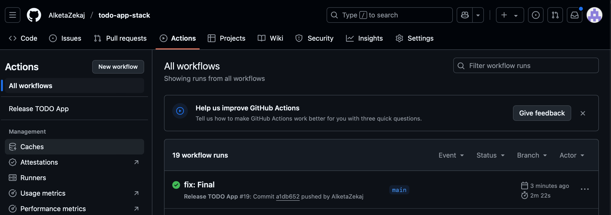

### Exercise3.03

In this exercise, I set up automatic deployment for a full-stack application consisting of:

Frontend: todo-app
Backend: todo-backend
Database: PostgreSQL

The deployment is managed using Kubernetes cluster (GKE — Google Kubernetes Engine), GitHub Actions (CI/CD pipeline), Docker (for containerizing the applications)

I started with creating a new GKE Kubernetes cluster in the region us-central1.
I Configured Google Cloud IAM roles and permissions for GitHub Actions.

I generated a key and used it to add github secrets:

Then I created a kustomization file and a main.yaml file that automates the proces of Building Docker images, Pushing images to Artifact Registry, Updating Kubernetes Deployments automatically, and added retry logic during rollout to handle potential Kubernetes delays.

 
Finally i pushed the chanes to github and we can see that the workflow is created and everything is working:

### Exercise3.04

In this exercise, I improved the CI/CD deployment pipeline to support branch-based environments.
The main branch deploys into todo-project namespace.
Any other branch creates and deploys into todo-project-branch-name namespace automatically.
Testing was completed by:
Creating a new branch feature-test.
Pushing a small change to trigger the workflow.
Confirming that a new namespace and deployments were created automatically.

### EXERCISE 3.05:

In this exercise, I created a new GitHub Actions workflow that automatically deletes the Kubernetes namespace when a branch is deleted.
This ensures that old or unused environments do not stay active, helping to manage cluster resources more efficiently.

Implementation Steps:
I created a new workflow file:
.github/workflows/delete-environment.yaml
The workflow triggers on the delete event for branches.
It authenticates to Google Cloud using a Service Account key.
It retrieves the GKE cluster credentials.
It calculates the namespace name based on the branch name:
If the branch was main, it would use the namespace todo-project.
Otherwise, it formats it like todo-project-branch-name.
It then runs a command to delete the corresponding namespace in Kubernetes:

### Exercise 3.08:

